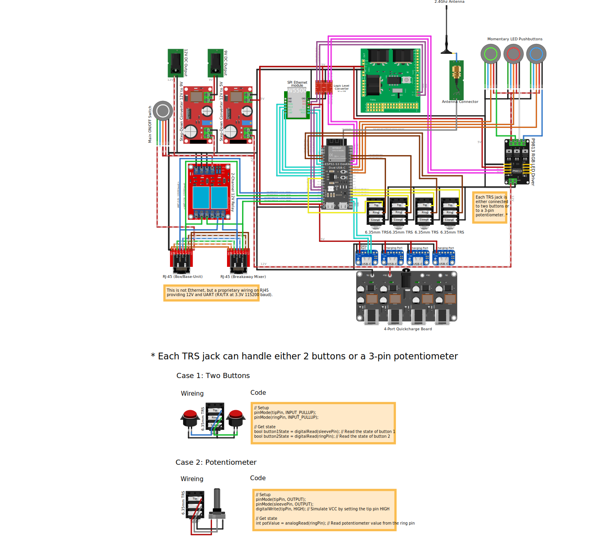

## Mackie Showbox Expansion Module
Gain more control over your Showbox. This project allows for controlling your Showbox and Breakaway Mixer using an ESP32-S3 and ESP32 (in the future also ESP8266 and Arduino).  
Change presets, volume, eq, effects or control the looper using any footswitch, expression pedal, MIDI device etc. Support for MIDI over Bluetooth, Wifi and Ethernet are planned as well.

### Disclaimer
This is still a work in progress. I have reverse-engineered most of the protocol, but a few bits here and there are still missing and stability isn't perfect yet.

### Hardware
This project is entirely based on widespread off-the-shelf hardware that can be found on aliexpress, ebay etc. 
I am providing a reference design that includes all the supported features, a 3D-printable case and a ready-to-go firmware that can be flashed through your browser. But all you really need is an ESP32/ESP32-S3 and two RJ45 breakout boards and maybe a TRS-jack to solder to the ESP to connect a footswitch or expression pedal.

### TODO (Software)
- [x] Class to programmatically do anything the Breakaway Mixer can do.
- [x] Example on how to add footswitches to control anything you want
- [ ] Add more examples
- [ ] Split UARTInterceptor and ShowboxExpansionModule into two libraries
- [ ] GitHub Actions for PlatformIO publishing
- [x] GitHub Actions to provide binary builds
- [ ] Add web interface to allow controlling the Showbox from the browser (over WiFi and Ethernet)
- [x] ESP Web Tools - Web flasher to allow flashing the micro controller from the browser
- [x] ImprovWifi - Configure Wifi settings from the browser
- [x] Add support for up to 4 dual foot switches (TRS jack)
- [x] Add support for up to 4 expression pedals (TRS jack)
- [ ] Add support for OTA updates
- [ ] Add support for MIDI
- [ ] Add support for MIDI over Bluetooth
- [ ] Add support for MIDI over WiFi
- [ ] Add support for MIDI over USB
- [ ] Add support for MIDI over Ethernet
- [ ] Add support for Mackie Control Protocol (which is technically just specially MIDI commands)
- [ ] Add support for using the breakaway mixer as a DAW controller (Would anyone even want this??)
- [ ] Add support for Bluetooth HID (to allow using it as a Bluetooth page turner as well)
- [ ] Add support for USB HID (to allow using it as a USB page turner as well)

### Reference design

#### Firmware
The firmware can be installed using the [Web Installer](https://t-vk.github.io/ShowboxExpansionModule/) or manually by setting up PlatformIO.

#### Schematics


#### 3D model
[](./docs/expansion-module-slid-in.jpeg) 
[](./docs/expansion-module-open-wired.jpeg) 
[](./docs/expansion-module-front-open.jpeg) 
[](./docs/expansion-module-top-open.jpeg)  
TODO: Add link to 3D model  

### Example code usage
This basic example shows how you could implement your own mute toggle button:

``` C++
#include <Arduino.h>
#include <OneButton.h>
#include "MackieShowbox/MackieShowbox.h"

MackieShowbox showbox(9, 10, 17, 18); // Base RX, Base TX, Mixer RX, Mixer TX

OneButton muteButton(48, true); // Mute button pin, internal pull-up

void handleMuteButton() {
    bool mute = showbox.getBoolEntityValue(entity_id::MAIN_MUTE);
    showbox.setEntityValue(entity_id::MAIN_MUTE, !mute);
}

void setup() {
    muteButton.attachClick(handleMuteButton);
    showbox.begin();
}

void loop() {
    showbox.loop();
    muteButton.tick();
}
```

### Reading
You can easily read and log what the two devices are talking about. Here is a short example:

```
MIXER->BASE [Decoded] Type: ENTITY | Entity: LOOPER_LEVEL | { Set LOOPER_LEVEL to 9.615385 }
MIXER->BASE [Decoded] Type: ENTITY | Entity: MAIN_MUTE | { Set MAIN_MUTE to false }
MIXER->BASE [Decoded] Type: ENTITY | Entity: STEREO_INPUT1_EQ_HIGH_GAIN | { Set STEREO_INPUT1_EQ_HIGH_GAIN to -12.857142 }
MIXER->BASE [Decoded] Type: ENTITY | Entity: SELECTED_CHAN | { Set SELECTED_CHAN to 0 }
MIXER->BASE [Decoded] Type: ENTITY | Entity: INPUT1_COMPRESSOR_AMOUNT | { Set INPUT1_COMPRESSOR_AMOUNT to 0.600000 }
MIXER->BASE [Decoded] Type: ENTITY | Entity: INPUT1_GAIN | { Set INPUT1_GAIN to 36.000000 }
MIXER->BASE [Decoded] Type: ENTITY | Entity: INPUT1_EQ_ENABLE | { Set INPUT1_EQ_ENABLE to false }
BASE->MIXER [Decoded] Type: ENTITY | Entity: INPUT1_EQ_ENABLE | { Set INPUT1_EQ_ENABLE to true }
MIXER->BASE [Decoded] Type: ENTITY | Entity: INPUT1_EFFECT_2_AMOUNT | { Set INPUT1_EFFECT_2_AMOUNT to 0.400000 }
MIXER->BASE [Decoded] Type: ENTITY | Entity: INPUT1_EXT_FX_SENDS | { Set INPUT1_EXT_FX_SENDS to 0.066667 }
```

Since the MackieControl Class is intercepting the entire communication, you can always ask it for information it has already intercepted. E.g.:

``` C++
bool mute = showbox.getBoolEntityValue(entity_id::MAIN_MUTE);
if (mute) {
    Serial.println("Showbox is currently muted")
}
```

### Injecting
You can easily inject packets into the communication of the devices which may look like this:

```
BASE->MIXER Acknowoleged LOOPER_BUTTON command
BASE->MIXER [Decoded] Type: ENTITY | Entity: LOOPER_STATE | { Set LOOPER_STATE to RECORD_INITIAL_LOOP }
BASE->MIXER Acknowoleged LOOPER_BUTTON command
BASE->MIXER Acknowoleged LOOPER_BUTTON command
BASE->MIXER [Decoded] Type: ENTITY | Entity: LOOPER_STATE | { Set LOOPER_STATE to PLAY }
BASE->MIXER Acknowoleged LOOPER_BUTTON command
BASE->MIXER [Decoded] Type: ENTITY | Entity: LOOPER_STATE | { Set LOOPER_STATE to DELETE }
```

In order to inject a packet, all you have to do is call a method on the MackieShowbox Class.

For example to mute the Mackie Showbox, you would simply do:

``` C++
showbox.setEntityValue(entity_id::MAIN_MUTE, true);
```

### Manipulating
It is technically possible to manipulate packets on the fly. This functionality is just not exposed to the outside of the class for now because I haven't found a good use-case for it yet.

### Dropping
It is technically possible to drop packets entirely, preventing them from arriving at their destination. This functionality is just not exposed to the outside of the class for now because I haven't found a good use-case for it yet.


### Documentation
Unfortunately I haven't found the time to document everything properly, but I created a lot of contants that acs as a reference for possible values to be passed the available functions: [src/constants.h](src/constants.h)   
Other than that, all I can give you for now, is a list of the available public methods:

``` C++
class MackieShowbox {
public:
    MackieShowbox(uint8_t baseRx, uint8_t baseTx, uint8_t mixerRx, uint8_t mixerTx);
    
    void setEntityValue(entity_id entityId, bool value, bool emit = true);
    void setEntityValue(entity_id entityId, uint8_t value, bool emit = true);
    void setEntityValue(entity_id entityId, float value, bool emit = true);

    bool getBoolEntityValue(entity_id entityId);
    uint8_t getUint8EntityValue(entity_id entityId);
    float getFloatEntityValue(entity_id entityId);

    void sendLooperButtonAction(looper_button_action action);
    void toggleSdCardRecord();
    void snapshotAction(snapshot_action action, snapshot_slot slot);
    void tunerAction(tuner_action action, tuner_chan chan);
    float getBatteryLevel();
    sd_card_state getSdCardState();

    void tick();
    void begin();
}
```

(might be out of date by the time you read this, so check against: [src/MackieShowbox/MackieShowbox.h](src/MackieShowbox/MackieShowbox.h) )

## Pin Mappings for ESP32-S3

### SPI Ethernet Module (Mini W5500)

```
µC Pin | Module Pin
-------------------
 6     | nReset
 7     | MISO
15     | nINT
16     | nSS
17     | SCLK
18     | MOSI
```

### TRS Jacks (For Footswitches / Expression Pedals)

```
µC Pin | Module Pin
-------------------
 8     | TRS 1 Tip
 2     | TRS 1 Ring
21     | TRS 2 Tip
 1     | TRS 2 Ring
47     | TRS 3 Tip
 4     | TRS 3 Ring
48     | TRS 4 Tip
 5     | TRS 4 Ring
```

### MIDI UART Module (Arduinio MIDI Shield)

```
µC Pin | Module Pin
-------------------
 9     | TX
10     | RX
```

### RGB LED Controller (P9813)

```
µC Pin | Module Pin
-------------------
42     | Data In
41     | Clock In
```

### Buttons

```
µC Pin | Module Pin
-------------------
40     | Green Button
39     | Red Button
38     | Blue Button
```

### Mackie Showbox Base-Unit

```
µC Pin | Module Pin
-------------------
11     | TX
12     | RX
```

### Mackie Showbox Breakaway Mixer

```
µC Pin | Module Pin
-------------------
13     | RX
14     | TX
```